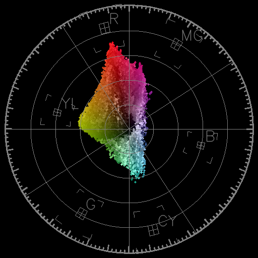

# vector_scope

Python implementation of NTSC vector scope.

## Description

Import a image file to draw NTSC vector scope.

## Requirement

- Python3
- Numpy
- cv2

## Usage

python vector_scope.py [image file name]

then get below.

## Author

delphinus1024

## License

[MIT](https://raw.githubusercontent.com/delphinus1024/vector_scope/master/LICENSE.txt)

